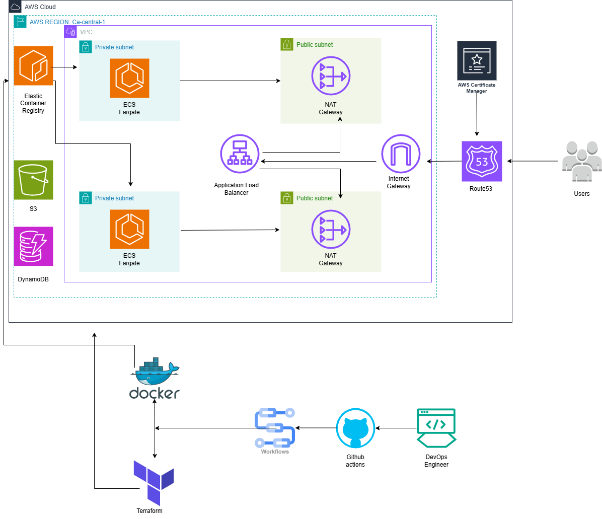
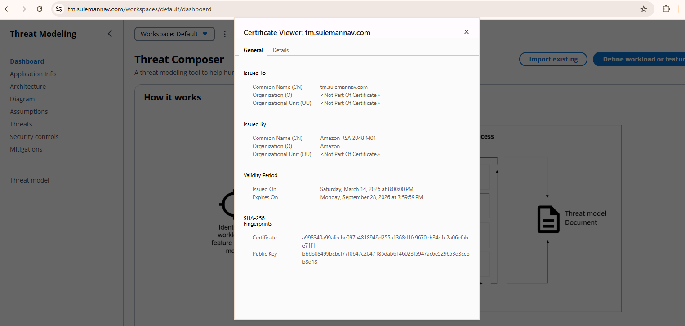
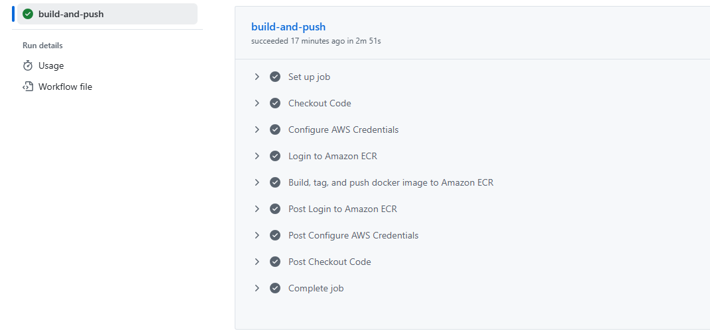
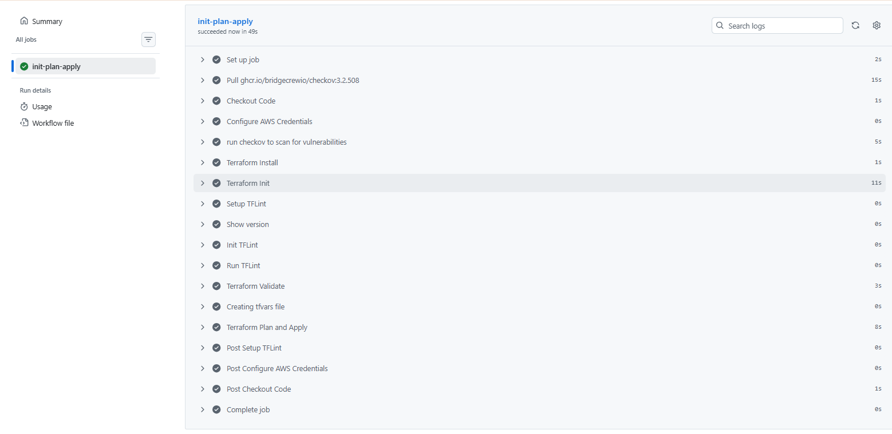
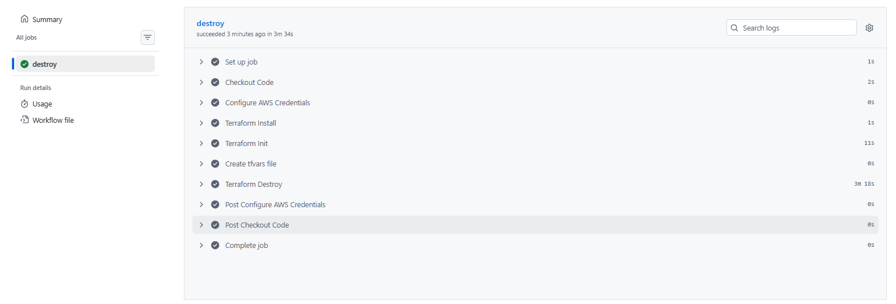

# Deploying AWS Threat Composer Application

## Introduction

This project deploys a Threat Composer application onto AWS ECS Fargate using Terraform. GitHub actions is utilized through CI/CD pipelines for automation and Docker is used to containerize the application. The Threat Composer application is used by security professionals to identify and mitigate threats to their systems. 

## Architecture Diagram



## Project Structure 
```
├── .github/
│   └── workflows/
│       ├── build-push.yml
│       ├── destroy.yml
│       └── init-plan-apply.yml
├── app/
│   ├── Dockerfile
│   └── .dockerignore
├── images/
├── terraform/
│   ├── modules/
│   │   ├── acm/
│   │   │   ├── main.tf
│   │   │   ├── output.tf
│   │   │   └── variables.tf
│   │   ├── alb/
│   │   │   ├── main.tf
│   │   │   ├── output.tf
│   │   │   └── variables.tf
│   │   ├── ecr/
│   │   │   ├── main.tf
│   │   │   ├── output.tf
│   │   │   └── variables.tf
│   │   ├── ecs/
│   │   │   ├── main.tf
│   │   │   ├── output.tf
│   │   │   └── variables.tf
│   │   └── vpc/
│   │       ├── main.tf
│   │       ├── output.tf
│   │       └── variables.tf
│   ├── main.tf
│   ├── provider.tf
│   ├── terraform.tfvars
│   └── variables.tf
├── .gitignore
└── README.md
```

## Prerequisites

* AWS account and 2FA enabled
* AWS CLI installed and connected to account
* Docker installed on local machine
* Terraform installed on local machine
* Domain name from AWS Route53 to host the app (preferably your name)
* GitHub actions OIDC token configured

## Setting App Up Locally
```
yarn install
yarn build
yarn global add serve
serve -s build

Then visit: http://localhost:3000
```

## Key Details

### Docker

Docker is used to containerize the Node.js application using a multi-stage build process. 
The multi-stage build reduces the final image size to decrease deployment time. A non-root 
user is configured for security to prevent unauthorized access and protect the file system.

### Terraform

Terraform is used to create the infrastructure on Amazon Web Services where the application 
will run, ensuring reusability, scalability and security. Some features include:

* Virtual Private Cloud with 2 Availability Zones and 2 public/private subnets to ensure 
  high availability and security.
* Application Load Balancer with security groups to verify incoming traffic and a target 
  group to direct traffic to healthy instances.
* Route 53 DNS to make the app accessible to the public with ACM included to secure the 
  site with HTTPS.
* Elastic Container Registry to store and manage the application image on AWS.
* Elastic Container Service running on Fargate to host and run the containerized application 
  serverlessly, removing the need to manage underlying infrastructure.
* S3 Bucket and DynamoDB for remote state storage and state locking, protecting against 
  multiple changes being made simultaneously.

### GitHub Actions

GitHub Actions is used to automate continuous integration and continuous deployment of our 
application. GitHub Actions utilizes Checkov to scan for any vulnerabilities in our 
infrastructure and TFLint to check for any errors in the Terraform code.

## Deployment Steps

### Step 1: AWS Backend

Navigate to the backend directory and deploy the remote state infrastructure

cd terraform/backend
terraform init
terraform apply
enter "yes"

This will create the S3 Bucket and Dynamodb.

### Step 2: GitHub Actions

Go to **Settings** then on left hand side **Secrets and Variables** then **Actions** create secrets with the values for the follow: AWS_CRED, AWS_REGION, DOCKER_IMAGE, ECR_REPO, TF_VARS.

### Step 3:

Go to **Actions** at the top of your repository toolbar. Under "All Workflows" manually run **Build and Push Docker image, -> Terraform Init Plan and Apply,** 

### Step 4:

Once the workflows complete successfully, visit your Route 53 domain and the application 
should be live and running.

### Step 5:

Once finished click on **Terraform Destroy** in **Actions** and run workflow to tear down all infrastructure.

## Certificate



## Application Running on Domain


## CI: Docker Image Pipeline



## CD: Terraform Init and apply Pipeline



## Terraform Destroy

